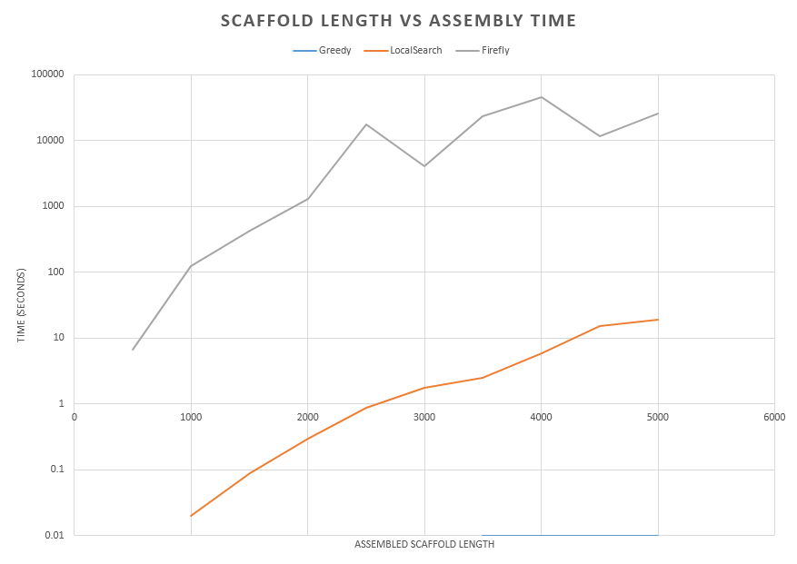

An analysis of Firefly and LocalSearch algorithms for short read assembly
=========================================================================
#### *Dan Haskin and Kyle Corbitt 12/5/2013*

Abstract
--------
Our purpose is to create a genome assembler based on a novel approach called the Firefly Algorithm (1).  We hypothesize that this will produce more accurate assemblies than other assemblers.

Introduction
------------
In the last decade genome sequencing data has exploded.  Thanks to hardware innovations such as 454 and Illumina sequencing the amount of DNA sequence data that is being generated each year is increasing exponentially.

As a result of this explosion of data new techniques are being developed to assemble the short and at times error-prone reads produced by these sequencers.  Currently the computational time required to accurately assemble a genome pro novo is a significant bottleneck in bioinformatics.  Algorithms exist that can assemble a genome in a relatively short time, but these algorithms typically are not able to guarantee an accurate assembly.  Conversely, algorithms exist that can guarantee an accurate assembly of reads but that are unacceptably inefficient.

Extensive work has been done in the field of computer science toward solving extremely difficult problems such as the Travelling Salesman Problem (TSP).  In brief, TSP involves finding the shortest route that an imaginary “salesman” might take between large numbers of cities while visiting each city exactly once.  This is a problem that has been extensively investigated for years, and many solutions have been proposed that can generate a near-optimal solution in reasonable timeframes (2).

By modeling genome assembly as a travelling salesman problem, we have been able to investigate the use of some of these established algorithms for this purpose.  This paper introduces techniques to model read alignment as a graph traversal problem and explores the use of the Firefly and LocalSearch algorithms in assembly.

Related Work
------------
In recent years a number of competing assemblers have been released that vary in quality and performance.  Over 40 such algorithms are listed on the Wikipedia page for sequence assembly (3).  We have reviewed three of the more popular sequencers to inform our own work.  These assemblers are:

 *	Bowtie (4)
 *	BWA (5)
 *	Velvet (6)

Materials and Methods
---------------------
### Graph Representation
In order to apply the LocalSearch and Firefly algorithms to an assembly task we must first represent the assembly as a graph.  An intuitive method of accomplishing this is shown below.

In this example, each node in the graph represents a short read.  The edges connecting the nodes represent overlaps.  For instance, the overlap between the first node and the second is 14 base pairs, the second and the third 9, etc.  The challenge of assembly then becomes finding a path through the graph that connects all the nodes and is as "long" as possible (contains the greatest possible number of overlaps).

In this example by simply choosing the path that connects all of the nodes vertically an optimal alignment can be generated.  However, with tens of thousands of reads and much more complex overlaps the process can become very difficult.

### LocalSearch Algorithm
The LocalSearch algorithm works by taking an initial path and then trying different variations on it to find a more efficient graph traversal.  In the example below the two edges connecting the central point from above are replaced by edges connecting the point from below, leading to a more efficient final path.  Local search is a well-established algorithm that can find a reasonably good solution in a short amount of time.

*LocalSearch example, photo courtesy http://www.cs.berkeley.edu/~vazirani/algorithms/chap9.pdf*

### Firefly Algorithm
The firefly algorithm is a novel approach to solving a graph-traversal problem.  A number of random paths through the graph are generated, and each one is called a "firefly".  Each random result is then evaluated to see how effectively it solved the problem.  Typically, these early solutions are quite poor.  However, the algorithm starts "moving" the fireflies (changing the paths) toward other fireflies that are better paths.  The better a path is, the more the other fireflies will be attracted to it, just as real fireflies are attracted by other bright fireflies.

In this way the paths all begin converging on the most optimal solution, which is an effective path traversal or, as in our case, a good alignment.

The Firefly algorithm also has the significant advantage of being easily parallelizable.  All the fireflies can be moved independently of each other, and as a result the process can easily be scaled to large clusters of machines for faster assembly.

### Choice of Language
We chose to implement our sequencer in C++.  C++ is a mature language with nearly ubiquitous cross-platform support.  It also benefits from a structure very conducive to optimization and many years of performance research.  Although we did little to optimize our actual algorithm implementations by programming them in C++ we were able to achieve more reasonable performance and create a solid foundation for future work.

Results
-------
After implementing the LocalSearch and Firefly algorithms as well as a basic greedy (shotgun) algorithm, we ran them against simulated reads generated from scaffolds between 500 and 5000 base pairs long with 5x coverage and a median read length of 100bp, intended to simulate real short read sequences.  We measured the algorithms' performance on three key metrics: the N50 length of the assemblies, the total number of contigs found, and the time necessary to run the algorithm.

Conclusions
-----------
After reviewing our results, it is evident that our implementation of the Firefly algorithm is incapable of assembling large numbers of reads.  However, both the LocalSearch and Greedy algorithms show good performance characteristics while assembling up to 5,000 reads, and similar performance could likely be achieved with larger numbers of reads. 

Future Work
-----------
The Firefly algorithm's greatest advantage is its ability to easily be parallelized across multiple cores and computers.  Although we did not implement this functionality in our initial version, adding it on should be simple.

We are not convinced that the Firefly algorithm's performance is as frankly terrible as it appears to be in our simple test.  With time spent profiling the algorithm and seeking improvements it may still be a viable solution to the problem of genome assembly.

References
----------
1. Wikipedia. Firefly algorithm. Wikipedia. [Online] August 1, 2013. [Cited: October 28, 2013.] https://en.wikipedia.org/wiki/Firefly_algorithm.
2. —. Travelling Salesman Problem. Wikipedia. [Online] December 3, 2013. http://en.wikipedia.org/wiki/Travelling_salesman_problem.
3. —. Sequence assembly. Wikipedia. [Online] 10 19, 2013. https://en.wikipedia.org/wiki/Sequence_assembly.
4. Ultrafast and memory-efficient aligment of short DNA sequences to the human genome. Langmead, B, et al. 10, Genome Biol, p. R25.
5. Fast and accurate short read alignment with Burrows-Wheeler Transform. Li, H and Durbin, R. Bioinformatics, pp. 25:1754-60.
6. Zarbino, Daniel and Birney, Ewan. Velvet: de novo assembly using very short reads. European Bioinformatics Institute. [Online] 2008. [Cited: 10 28, 2013.]
